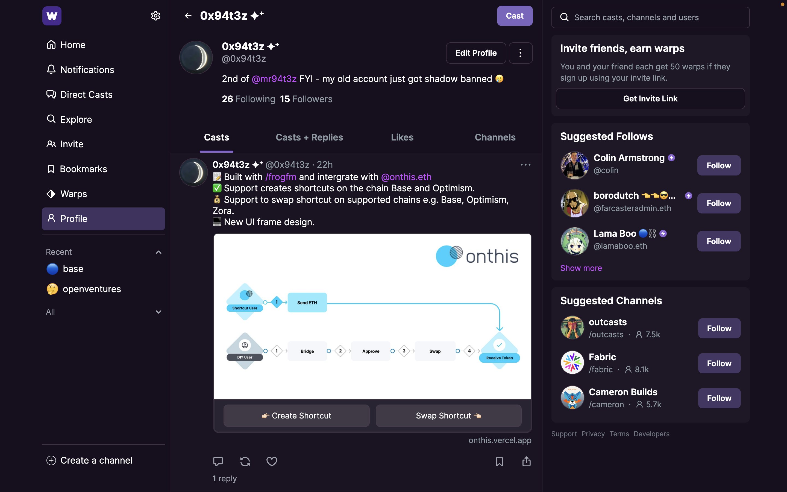
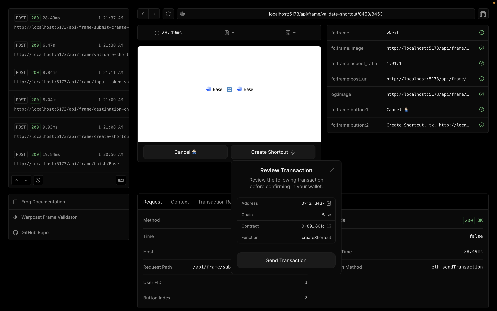
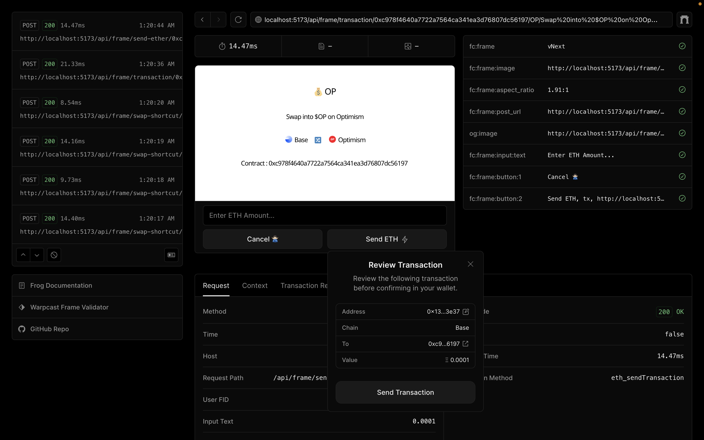
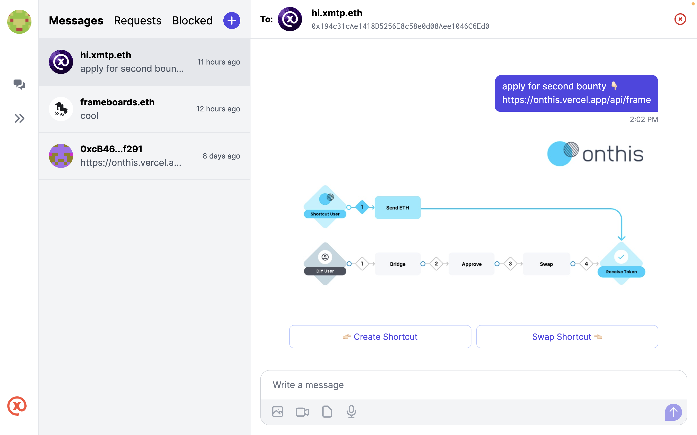

###  Onthis Frame

The Farcaster Frame for Creating and Swapping Shortcuts seamlessly integrates with https://create.onthis.xyz/.

### Command

```
npm install
npm run dev
```

Head to http://localhost:5173/api/frame


### Deploy to Vercel

```
npm run deploy
```

### Frame Overview

The cast view on Warpcast.



Create shortcut overview.



Swap shortcut overview.



The frame can be view using `XMTP` - https://xmtp.chat/ tho.

